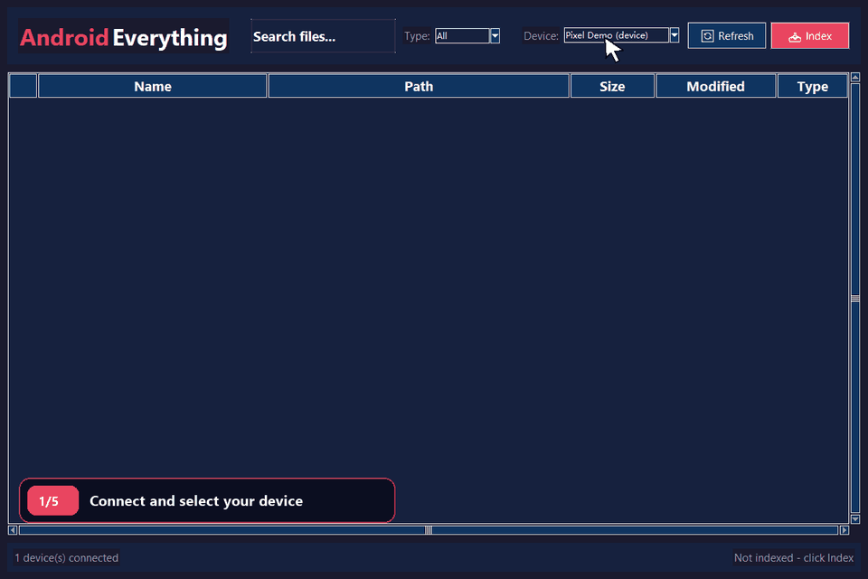
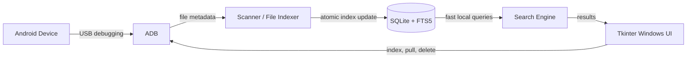

<h1 align="center">Android Everything</h1>

<p align="center">
  <strong>Search your Android phone from Windows with the speed and workflow of Everything.</strong>
</p>

<p align="center">
  <a href="https://github.com/luli395/android_everything/releases/latest"></a>
  <a href="https://github.com/luli395/android_everything/actions/workflows/ci.yml"></a>
  <a href="LICENSE"></a>
  
</p>

<p align="center">
  <a href="https://github.com/luli395/android_everything/releases/download/v0.1.5/AndroidEverything-v0.1.5-windows.zip"></a>
</p>

<p align="center">
  
</p>

<p align="center">
  <sub>The demo uses a simulated device and synthetic file names; no personal phone data is recorded.</sub>
</p>

Android Everything connects through Android Debug Bridge (ADB), creates a local
SQLite/FTS5 metadata index, and turns Android file browsing into a responsive,
search-as-you-type Windows workflow. Index once, then find files by name or path
without reopening folders across the phone for every search.

## Start searching in three steps

1. **Download and extract** the complete [Windows ZIP for v0.1.5](https://github.com/luli395/android_everything/releases/download/v0.1.5/AndroidEverything-v0.1.5-windows.zip).
2. **Connect and authorize** the phone: enable USB debugging, connect it over USB, and approve the computer on the device.
3. **Run and search**: start `AndroidEverything.exe`, select the device, click **Index**, and begin typing.

The package contains `AndroidEverything.exe`, ADB, its required DLLs, and the
Android Platform Tools notice. Python and a separate ADB installation are not
required. Keep all extracted files together.

> [!TIP]
> If the phone is shown as `unauthorized`, unlock it and accept the USB debugging prompt, then click **Refresh**.

## Why Android Everything?

| Task | File Explorer / MTP workflow | Android Everything workflow |
| --- | --- | --- |
| Find a file anywhere on the phone | Open storage and navigate folders | Type a name or path and see matches immediately |
| Repeat a search | Browse the device again | Query the reusable local index |
| Narrow a result set | Navigate or reorganize folders | Filter by extension and sort any result column |
| Bring a file to Windows | Browse to it, then copy it | Pull, open, or reveal the selected result |

The experience is inspired by the fast workflow of
[Everything](https://www.voidtools.com/) for local Windows files. Android
Everything is an independent open-source project and is not affiliated with or
endorsed by voidtools.

## Highlights

- **True substring search** across names and Android paths, so `hot` can match `photo.jpg`
- **Reusable local index** of names, paths, sizes, extensions, and modification times
- **Safe SQLite FTS5 trigram queries** for spaces, quotes, parentheses, hyphens, and other special characters
- **Atomic indexing** that preserves the previous usable index if a refresh fails or is cancelled
- **Multi-storage discovery** for internal storage, SD cards, and common external-storage paths
- **Explicit device binding** so indexing, pulling, and deleting remain tied to the selected ADB serial
- **Serialized device mutations** so deleting during a refresh cannot leave stale search results
- **Desktop file actions** to pull, open, reveal in Explorer, copy paths, or delete after confirmation
- **No third-party runtime dependencies** when running the Python source

## How it works



**ADB → Scanner → SQLite/FTS5 → Tkinter**

1. **ADB** discovers devices and performs serial-bound Android file operations.
2. **Scanner** reads metadata and prepares a complete replacement index.
3. **SQLite/FTS5** commits the new index atomically and serves local searches.
4. **Tkinter** presents the familiar Windows desktop search and file-action workflow.

## Download and verify

Current release: **v0.1.5**

- [Complete Windows ZIP](https://github.com/luli395/android_everything/releases/download/v0.1.5/AndroidEverything-v0.1.5-windows.zip)
- [ZIP SHA-256 checksum](https://github.com/luli395/android_everything/releases/download/v0.1.5/AndroidEverything-v0.1.5-windows-SHA256.txt)
- [Release notes](https://github.com/luli395/android_everything/releases/tag/v0.1.5)

Place the ZIP and checksum file in the same directory, then verify them in
PowerShell:

```powershell
$expected = (Get-Content .\AndroidEverything-v0.1.5-windows-SHA256.txt).Split()[0]
$actual = (Get-FileHash .\AndroidEverything-v0.1.5-windows.zip -Algorithm SHA256).Hash.ToLowerInvariant()
$actual -eq $expected
```

The result should be `True`. The bundled ADB comes from
[Android SDK Platform Tools](https://developer.android.com/tools/releases/platform-tools).
Keep `adb.exe`, `AdbWinApi.dll`, and `AdbWinUsbApi.dll` beside
`AndroidEverything.exe` after extraction.

## Documentation and requirements

- [English User Guide](docs/USER_GUIDE.md)
- Windows 10 or later
- An Android device with USB debugging enabled

Running from source additionally requires Python 3.8 or later with Tkinter and
[Android SDK Platform Tools](https://developer.android.com/tools/releases/platform-tools).

## Run from source

1. Clone the repository:

   ```powershell
   git clone https://github.com/luli395/android_everything.git
   cd android_everything
   ```

2. Add Platform Tools to `PATH`, or point the application to ADB explicitly:

   ```powershell
   $env:ANDROID_EVERYTHING_ADB = "C:\path\to\platform-tools\adb.exe"
   ```

3. Connect and authorize the phone, then confirm that ADB sees it:

   ```powershell
   adb devices
   ```

4. Start the application:

   ```powershell
   python main.py
   ```

Select a device, click **Index**, and search by file name or Android path.

## Configuration

Defaults are defined in [`config.py`](config.py).

| Environment variable | Purpose |
| --- | --- |
| `ANDROID_EVERYTHING_ADB` | Absolute path to `adb.exe`; if unset, the application searches its package directory and `PATH`. |
| `ANDROID_EVERYTHING_DATA_DIR` | Optional override for the index and application-log directory. |

The SQLite index and log are stored under
`%LOCALAPPDATA%\AndroidEverything` by default.

## Privacy

All searches and indexed metadata remain local to the PC. The index can contain
device serials and Android file paths, so do not share
`%LOCALAPPDATA%\AndroidEverything\files.db`. Files pulled from a phone should
also remain outside the repository.

The README GIF is generated from an in-memory demo backend and contains only
synthetic paths and file names.

## Development

Run the syntax check and unit tests:

```powershell
python -m compileall -q .
python -m unittest discover -s tests -v
```

Build the standalone executable and complete Windows package with PyInstaller:

```powershell
.\scripts\build_windows.ps1 -AdbPath "C:\path\to\platform-tools\adb.exe"
```

Regenerate the privacy-safe README demo from the real Tkinter widgets:

```powershell
python -m pip install Pillow
python .\scripts\create_demo_gif.py
```

The capture utility is development-only; Pillow is not an application runtime
dependency. It requires a visible Windows desktop session and never connects to
ADB or reads the local application database.

### Project structure

```text
android_everything/
|-- main.py                  # Application entry point
|-- adb_wrapper.py           # ADB discovery and file operations
|-- file_indexer.py          # Device scanner and atomic indexing pipeline
|-- database.py              # SQLite and FTS5 persistence
|-- device_mutation.py       # Per-device indexing/deletion coordination
|-- search_engine.py         # Search API and query cache
|-- path_utils.py            # Safe Windows download-path handling
|-- config.py                # Application defaults
|-- docs/                    # User guide and README media
|-- scripts/                 # Windows packaging and demo-capture tools
`-- ui/                      # Tkinter window, file list, and styling
```

Bug reports and focused pull requests are welcome. See
[CONTRIBUTING.md](CONTRIBUTING.md) and [SECURITY.md](SECURITY.md).

## License

Licensed under the [MIT License](LICENSE).
