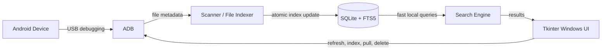

# Android Everything

**Bring the Everything-style file-search experience on Windows to your Android device.**

Android Everything connects to an Android phone through Android Debug Bridge (ADB), builds a local SQLite/FTS5 index, and lets you search the device's files from a responsive Windows desktop interface. Index once, then type to find files quickly—similar to using [Everything](https://www.voidtools.com/) for local Windows files.

> Android Everything is inspired by the fast, search-as-you-type workflow of Everything. It is an independent open-source project and is not affiliated with or endorsed by voidtools. The application is currently under active development.

## Why Android Everything?

Android file browsing from Windows often means opening folders one by one and waiting for the device connection. Android Everything instead provides a familiar desktop search workflow:

1. Connect and select an Android device.
2. Build a local metadata index with one click.
3. Start typing to find files by name or path immediately.
4. Filter and sort results, then pull, open, locate, copy the path, or delete selected files.

The index stays on your PC, so repeated searches query the local database rather than walking the phone's storage every time.

## Architecture



1. **ADB** discovers connected devices and performs Android file operations.
2. **Scanner** reads file metadata and prepares a complete device index.
3. **SQLite/FTS5** stores the index locally and provides prefix search.
4. **Search Engine** queries and caches results for the selected device.
5. **Tkinter UI** provides the Everything-style Windows search workflow.

## Documentation

- [English User Guide](docs/USER_GUIDE.md)

## Download for Windows

Download `AndroidEverything.exe` from the [latest GitHub release](https://github.com/luli395/android_everything/releases/latest). The executable is a standalone Windows build, so Python is not required.

ADB is not bundled. Install [Android SDK Platform Tools](https://developer.android.com/tools/releases/platform-tools), add its directory to `PATH`, then start `AndroidEverything.exe`. You can verify the download with the SHA-256 checksum file attached to the same release.

## Features

- Discover connected Android devices through ADB
- Detect internal storage, SD cards, and common external-storage paths
- Build a reusable local index of file names, paths, sizes, and modification times
- Get an Everything-style, search-as-you-type workflow with SQLite FTS5 prefix matching
- Filter results by file extension and sort by column
- Pull files to the computer, open them, or reveal them in Explorer
- Copy Android paths and delete selected device files after confirmation
- Dark desktop interface with no third-party Python dependencies

## Requirements

- Windows 10 or later
- [Android SDK Platform Tools](https://developer.android.com/tools/releases/platform-tools)
- An Android device with USB debugging enabled

Running from source additionally requires Python 3.8 or later with Tkinter.

## Quick start

1. Clone the repository:

   ```powershell
   git clone https://github.com/luli395/android_everything.git
   cd android_everything
   ```

2. Make `adb` available using either approach:

   - Add the Platform Tools directory to `PATH`; or
   - Set the executable explicitly:

     ```powershell
     $env:ANDROID_EVERYTHING_ADB = "C:\path\to\platform-tools\adb.exe"
     ```

3. Connect the phone over USB, enable **Developer options > USB debugging**, and approve the computer on the device.

4. Confirm that ADB sees the device:

   ```powershell
   adb devices
   ```

5. Start the application:

   ```powershell
   python main.py
   ```

Select a device, click **Index**, and then search by file name or path.

## Configuration

The defaults are defined in [`config.py`](config.py). The most useful runtime setting is:

| Environment variable | Purpose |
| --- | --- |
| `ANDROID_EVERYTHING_ADB` | Absolute path to the `adb` executable. If unset, the application searches `PATH`. |
| `ANDROID_EVERYTHING_DATA_DIR` | Optional override for the directory that stores the index and application log. |

The SQLite index and application log are stored under `%LOCALAPPDATA%\AndroidEverything` by default. Device content, exported files, database indexes, caches, and local environment files are intentionally excluded from version control.

## Project structure

```text
android_everything/
|-- main.py             # Application entry point
|-- adb_wrapper.py      # ADB discovery and file operations
|-- file_indexer.py     # Device scanner and indexing pipeline
|-- database.py         # SQLite and FTS5 persistence
|-- search_engine.py    # Search API and query cache
|-- config.py           # Application defaults
|-- docs/               # User documentation
|-- scripts/            # Windows build script
`-- ui/                 # Tkinter window, file list, and styling
```

## Privacy

Android Everything processes device metadata locally. The generated index can include device serials and file paths, so `%LOCALAPPDATA%\AndroidEverything\files.db` must not be shared. Files pulled from a phone should likewise remain outside the repository.

## Development

The current code uses only the Python standard library. Run the syntax check and unit tests with:

```powershell
python -m compileall -q .
python -m unittest discover -s tests -v
```

Bug reports and focused pull requests are welcome. See [CONTRIBUTING.md](CONTRIBUTING.md).

## License

Licensed under the [MIT License](LICENSE).
